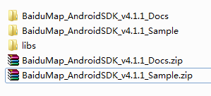
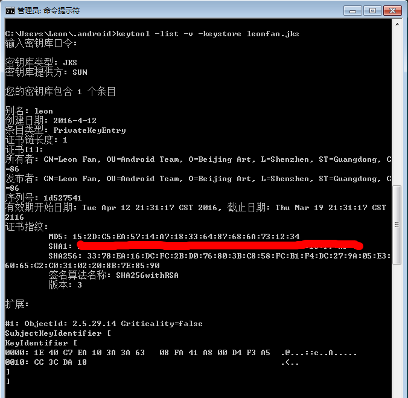
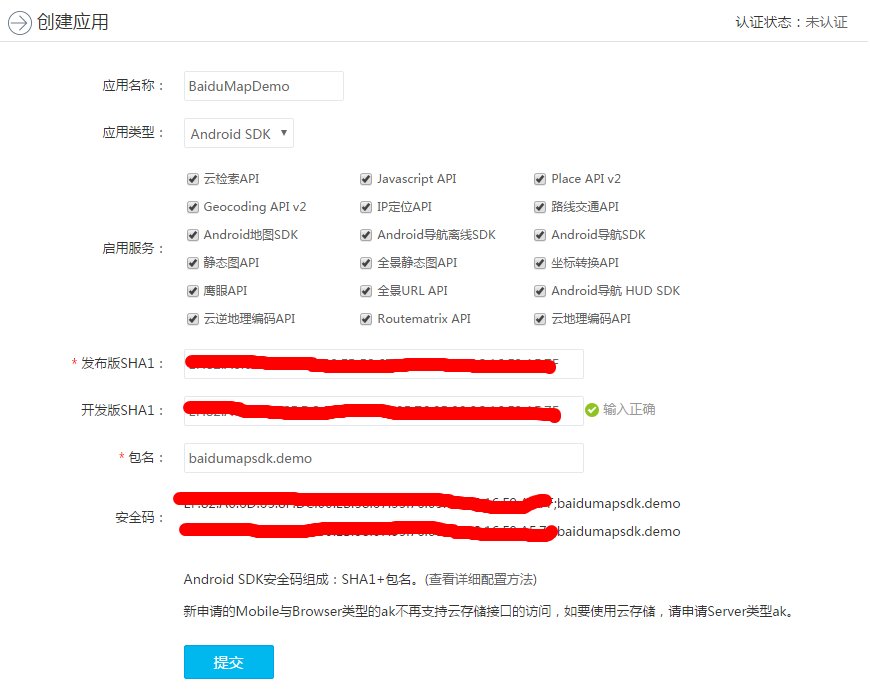
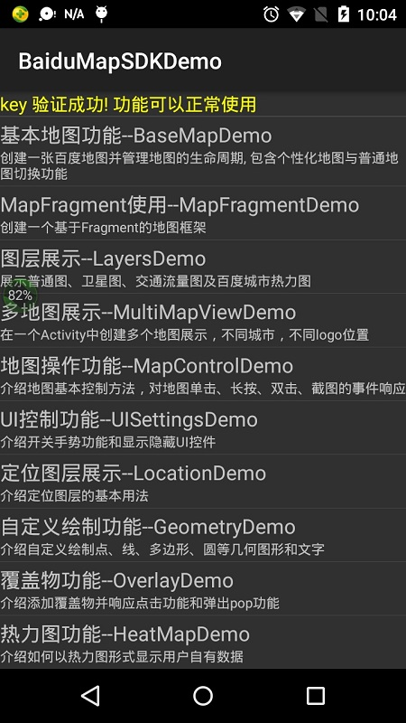
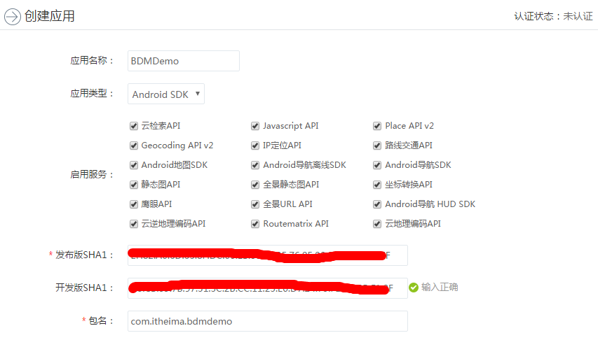

# 前言 #
现在的很多移动应用都是基于LBS(Location Based Service)，比如打车，外卖，短租, 运动类的应用，这些应用通常集成第三方的地图
服务，国内有百度地图，高德地图，腾讯地图等，国外有Google Maps, MapBox等。这里我们只和大家玩一玩百度地图，其他
的地图集成大同小异。

## 百度地图 ##
百度地图的SDK做了功能模块化的处理，每个功能模块都有独立的SDK，这样用户可以根据需求选择需要的模块集成进自己的项目。

* Android地图SDK
* Android定位SDK
* Android鹰眼轨迹SDK
* Android导航SDK
* Android导航HUD SDK
* Android全景SDK

### HUD (Heads Up Display) ###
平视显示器（Head Up Display）是目前普遍运用在航空器上的飞行辅助仪器。平视的意思是指飞行员不需要低头就能够看到他需要的重要资讯。

# Android地图SDK Demo #
## 下载Demo ##
[下载地址](http://lbsyun.baidu.com/index.php?title=androidsdk/sdkandev-download)

## 导入Demo ##
解压下载下来的压缩包。

Sample目录下有两个Demo，BaiduMapsApiASDemo为Android Studio项目，BaiduMapsApiDemo为Eclipse项目，这里我们
导入BaiduMapsApiASDemo。

## 申请密钥 ##
[官方文档](http://lbsyun.baidu.com/index.php?title=androidsdk/guide/key)
### 获取Debug版本的SHA1 ###
密钥库口令为：android

### 获取Release版本的SHA1 ###
查看.android下是否存在release版本的签名文件：xxx.jks，如果没有，则在AS中创建一个。

密钥库口令为：签名文件xxx.jks的密码

## 创建应用 ##

[在终端如何复制sha1](http://jingyan.baidu.com/article/93f9803fd3a4dde0e46f55f5.html)

## 运行Demo ##
* 将创建应用生成的API_KEY，即AK，写入AndroidManifest.xml中的meta data。

		<meta-data
		   	android:name="com.baidu.lbsapi.API_KEY"
		    android:value="3iGdR8lexGkGXfsxadCOvFBTYSfnx9zf" />

* 将.android目录下的debug.keystore替换掉Demo目录下的debug.keystore，或者直接注释掉app模块下build.gradle文件中
对debug.keystore的配置，AS就会默认使用.android目录下的debug.keystore。

	    //注释掉后会默认使用.android目录下的debug.keystore
	    //signingConfigs {
	        // your debug keystore
	        //debug{
	        //    storeFile file("debug.keystore")
	        //}
	    //}
* 如果key验证成功，就会提示功能可以正常使用

      

# 基础地图 #
接下来我们自己写一个Demo来集成百度SDK耍一耍。
## 创建应用 ##
用AS新建一个项目，取名BDMDemo，同样的，我们先[申请密钥](http://lbsyun.baidu.com/index.php?title=androidsdk/guide/key)。

## 集成SDK ##
[集成SDK文档](http://lbsyun.baidu.com/index.php?title=androidsdk/guide/buildproject)

这里将之前下载的sdk里面libs目录下所有的jar包和so文件全部导入项目，实际项目中可以有选择的导入。

## 初始化SDK ##
[初始化SDK文档](http://lbsyun.baidu.com/index.php?title=androidsdk/guide/hellobaidumap)
### 指定debug.keystore ###
为了大家下载代码后能直接使用, 这里将我的.android目录下的debug.keystore复制到app模块目录，并在build.gradle里面指定。

    signingConfigs {
        debug {
            storeFile file("debug.keystore")
        }
    }

### 在Application类里面初始化SDK ###
    @Override
    public void onCreate() {
        super.onCreate();
        SDKInitializer.initialize(getApplicationContext());
    }

# 放大 #
    private void zoomIn() {
        MapStatusUpdate mapStatusUpdate = MapStatusUpdateFactory.zoomIn();
        mMap.animateMapStatus(mapStatusUpdate);//动画方式改变地图状态
        mMap.setOnMapStatusChangeListener(mOnMapStatusChangeListener);
    }
# 缩小 #
    private void zoomOut() {
        mMap.animateMapStatus(MapStatusUpdateFactory.zoomOut());
        mMap.setOnMapStatusChangeListener(mOnMapStatusChangeListener);
    }

# 旋转 #
    private void rotate() {
        MapStatus mapStatus = mMap.getMapStatus();
        MapStatus.Builder builder = new MapStatus.Builder();
        builder.rotate(mapStatus.rotate + 90);//逆时针旋转
        MapStatusUpdate rotateUpdate = MapStatusUpdateFactory.newMapStatus(builder.build());
        mMap.animateMapStatus(rotateUpdate);
    }

# 平移 #
    private void translate() {
        MapStatus.Builder translateBuilder = new MapStatus.Builder();
        translateBuilder.target(mLatLng).zoom(18);
        mMap.animateMapStatus(MapStatusUpdateFactory.newMapStatus(translateBuilder.build()));
    }

# 标注覆盖物 #
    private void addMarkerOverlay() {
        //构建MarkerOption，用于在地图上添加Marker
        OverlayOptions option = new MarkerOptions().position(mLatLng).icon(mMarkBitmap)
                .animateType(MarkerOptions.MarkerAnimateType.grow)
                .title("中粮商务公园");
        //在地图上添加Marker，并显示
        mMap.addOverlay(option);
    }

# 圆形覆盖物 #
    private void addCircleOverlay() {
        OverlayOptions overlayOptions = new CircleOptions().center(mLatLng)
                .fillColor(Color.BLUE).radius(30)
                .stroke(new Stroke(5, Color.GREEN));//30m
        mMap.addOverlay(overlayOptions);
    }

# 几何图形覆盖物 #
    private void addPolyOverlay() {
        List<LatLng> latLngs = new ArrayList<LatLng>();
        latLngs.add(new LatLng(22.582803, 113.930234));
        latLngs.add(new LatLng(22.581843, 113.931209));
        latLngs.add(new LatLng(22.580417, 113.929435));
        latLngs.add(new LatLng(22.581372, 113.928563));
        OverlayOptions overlayOptions = new PolygonOptions().points(latLngs)
                .stroke(new Stroke(5, Color.GREEN)).fillColor(0xAAFFFF00);
        mMap.addOverlay(overlayOptions);
    }

# 文本覆盖物 #
    private void addTextOverlay() {
        OverlayOptions overlayOptions = new TextOptions().text("黑马程序员").fontColor(Color.BLACK).fontSize(30).position(mLatLng);
        mMap.addOverlay(overlayOptions);
    }

# POI搜索 #
    private void poiSearch() {
        PoiNearbySearchOption poiNearbySearchOption = new PoiNearbySearchOption().keyword("超市").location(mLatLng).radius(300);
        mPoiSearch.searchNearby(poiNearbySearchOption);
    }
# 线路规划 #
    private void routePlan() {
        PlanNode stMassNode = PlanNode.withCityNameAndPlaceName("深圳", "兴东");
        PlanNode enMassNode = PlanNode.withCityNameAndPlaceName("深圳", "高新园");
        mSearch.transitSearch(new TransitRoutePlanOption().city("深圳").from(stMassNode).to(enMassNode));
    }

# 定位 #
[官方文档](http://lbsyun.baidu.com/index.php?title=android-locsdk)

## 申请密钥 ##
同地图SDK的集成

## 导入SDK ##

## 配置环境 ##
    <!--Service一定要放在Applicatoin标签内-->
    <service android:name="com.baidu.location.f" android:enabled="true" android:process=":remote"/>

## 获取位置 ##
    mLocationClient = new LocationClient(getApplicationContext());     //声明LocationClient类
    mLocationClient.registerLocationListener(myListener);    //注册监听函数
    initLocation();
    mLocationClient.start();
## 定位图层 ##
[官方文档](http://lbsyun.baidu.com/index.php?title=androidsdk/guide/location)
